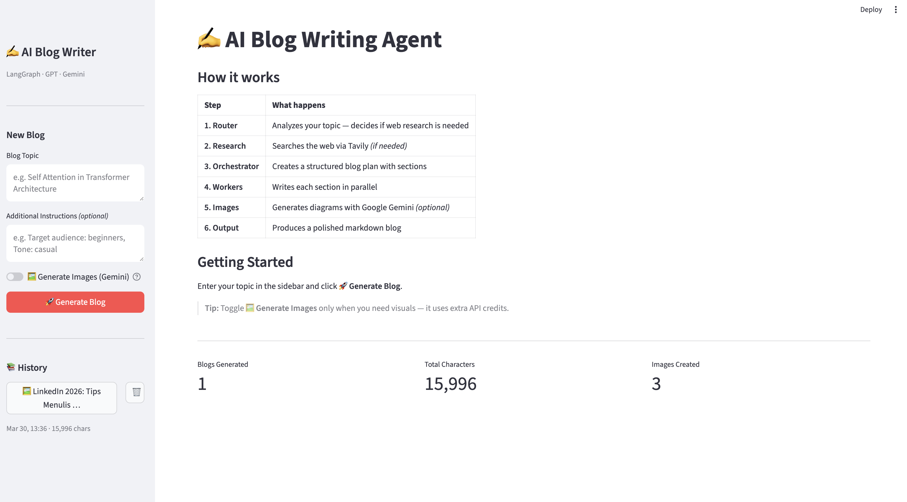

# AI Blog Writing Agent

A sophisticated **Planning AI Agent** built with **LangGraph** that generates comprehensive, research-backed blog posts with automatic image generation. Unlike simple LLM prompts, this agent creates a structured plan first, then executes it step-by-step for higher quality output.



---

## Features

- **Intelligent Planning**: Creates a structured blog plan with sections, target word counts, and content guidelines before writing
- **Parallel Section Writing**: Uses the Orchestrator-Worker pattern to write multiple sections simultaneously
- **Smart Research**: Automatically determines if internet research is needed (via Tavily) for recent topics
- **Auto Image Generation**: Identifies where diagrams/visuals would help, generates them via Google Gemini, and places them in the blog
- **Interactive GUI**: Streamlit interface with real-time progress tracking, plan visualization, and blog history
- **Evidence & Citations**: Research-backed blogs include source citations with clickable links
- **Persistent History**: Save and revisit previously generated blogs anytime

---

## Architecture

```
START (topic)
  │
  ▼
ROUTER NODE ── decides: needs_research? (true/false)
  │
  ├─ true ──▶ RESEARCH NODE ──▶ ORCHESTRATOR (Planner) NODE
  │                                    │
  └─ false ────────────────────────────┘
                                       │
                                       ▼
                              ORCHESTRATOR creates Plan
                              (title + list of Task objects)
                                       │
                            ┌──────────┼──────────┐
                            ▼          ▼          ▼
                        WORKER 1   WORKER 2   WORKER N  (parallel)
                            │          │          │
                            └──────────┼──────────┘
                                       │
                                       ▼
                              REDUCER SUB-GRAPH
                              ├─ Merge Content
                              ├─ Decide Images
                              └─ Generate & Place Images
                                       │
                                       ▼
                                 FINAL BLOG (.md file + images/)
```

### Key Components

| Node | Purpose |
|------|---------|
| **Router** | Decides if the topic requires internet research for recent information |
| **Research** | Generates search queries and fetches evidence via Tavily |
| **Orchestrator** | Creates a structured `Plan` with sections, target words, and metadata |
| **Workers** | Parallel nodes that write individual blog sections |
| **Reducer** | Sub-graph that merges sections, decides image placement, generates images via Gemini |

---

## Installation

### Prerequisites

- Python 3.9 or higher
- API keys for OpenAI, Tavily, and Google Gemini

### 1. Clone the Repository

```bash
git clone https://github.com/yourusername/ai-blog-writing-agent.git
cd ai-blog-writing-agent
```

### 2. Install Dependencies

```bash
pip install -r requirements.txt
```

### 3. Configure API Keys

Create a `.env` file in the project root:

```bash
OPENAI_API_KEY=sk-your-openai-key-here
TAVILY_API_KEY=tvly-your-tavily-key-here
GOOGLE_API_KEY=your-gemini-api-key-here
```

#### Getting API Keys

- **OpenAI**: [platform.openai.com](https://platform.openai.com/api-keys)
- **Tavily**: [tavily.com](https://tavily.com) — Free tier available
- **Google Gemini**: [aistudio.google.com](https://aistudio.google.com/app/apikey) — Pay-as-you-go recommended for image generation (~$1.50 USD for 30-40 blogs)

---

## Usage

### Launch the Application

```bash
streamlit run streamlit_app.py
```

The app will open at `http://localhost:8501`

### Generating a Blog

1. **Enter Topic**: Type your blog topic in the sidebar (e.g., "Self-Attention in Transformer Architecture")
2. **Optional Instructions**: Specify audience, tone, or any specific requirements
3. **Click "Generate Blog"**: The agent will execute its workflow:
   - Router decides if research is needed
   - Research node fetches online evidence (if required)
   - Orchestrator creates a structured plan
   - Workers write sections in parallel
   - Reducer merges content, decides images, generates & places them
4. **View Results**: Explore the Plan, Blog, Evidence, Logs, and Images tabs

### Example Topics

- "State of Multimodal LLMs in 2026" (triggers research)
- "Self-Attention in Transformer Architecture" (no research needed)
- "Top AI News of January 2026" (requires research + citations)
- "How Diffusion Models Work" (text + diagrams)

---

## Project Structure

```
ai-blog-writing-agent/
├── .env                      # API keys (not tracked by git)
├── .env.example              # Example environment variables
├── backend.py                # Core LangGraph agent logic
│   ├── Pydantic schemas
│   ├── Node implementations
│   └── Graph wiring
├── streamlit_app.py          # Streamlit GUI application
├── requirements.txt          # Python dependencies
├── output/                   # Generated blog outputs
│   ├── blog.md              # Final blog (markdown)
│   └── images/              # Auto-generated images
│       ├── diagram_1.png
│       └── diagram_2.png
├── history/                  # Blog history persistence
│   └── blogs.json
├── README.md                 # This file
└── LICENSE                   # MIT License
```

---

## Technical Details

### Core Technologies

| Component | Technology |
|-----------|------------|
| Agent Framework | [LangGraph](https://langchain-ai.github.io/langgraph/) |
| LLM (Text) | OpenAI GPT-4 / GPT-4o |
| Structured Output | Pydantic v2 |
| Web Search | Tavily API |
| Image Generation | Google Gemini 2.0 Flash |
| Frontend | Streamlit |
| State Management | TypedDict with `Annotated` operators |

### Design Patterns

- **Planning Agent**: Two-phase execution — plan first, then execute
- **Orchestrator-Worker**: Fan-out to parallel workers, fan-in to reducer
- **Conditional Routing**: Dynamic path selection based on topic analysis
- **Sub-Graphs**: Reducer implemented as nested graph for image pipeline

### Pydantic Schemas

```python
class Task(BaseModel):
    """Single blog section task"""
    id: str           # e.g., "section_1"
    title: str        # Section heading
    description: str  # Detailed writing instructions

class Plan(BaseModel):
    """Complete blog plan from Orchestrator"""
    title: str
    tasks: List[Task]

class ImageSpec(BaseModel):
    """Image generation specification"""
    placeholder: str   # e.g., "{{IMAGE_1}}"
    file_name: str     # Target filename
    prompt: str        # Gemini generation prompt
```

---

## Configuration

### Environment Variables

| Variable | Required | Description |
|----------|----------|-------------|
| `OPENAI_API_KEY` | Yes | For text generation and planning |
| `TAVILY_API_KEY` | Yes | For internet research (free tier: 1,000 requests/month) |
| `GOOGLE_API_KEY` | Yes | For image generation via Gemini |

### Customization Options

Edit `backend.py` to customize:

- **Blog length**: Modify target word counts in the Orchestrator prompt
- **Max images**: Change the limit in the Decide Images node (default: 3)
- **Image style**: Update the image prompt templates for different visual styles
- **Section count**: Adjust min/max sections in the planning prompt

---

## Cost Estimates

Based on typical usage:

| Component | Estimated Cost |
|-----------|---------------|
| OpenAI (text) | ~$0.10-0.30 per blog |
| Tavily (search) | Free tier covers ~100 blogs |
| Gemini (images) | ~$0.04 per image (~$0.12 per blog with 3 images) |
| **Total per blog** | **~$0.20-0.50 USD** |

*Actual costs depend on blog length, section count, and image quantity.*

---

## Contributing

Contributions are welcome! Please feel free to submit a Pull Request.

1. Fork the repository
2. Create your feature branch (`git checkout -b feature/AmazingFeature`)
3. Commit your changes (`git commit -m 'Add some AmazingFeature'`)
4. Push to the branch (`git push origin feature/AmazingFeature`)
5. Open a Pull Request

---

## License

Distributed under the MIT License. See `LICENSE` for more information.

---

## Acknowledgments

- Built with [LangGraph](https://langchain-ai.github.io/langgraph/) — the framework for building agent workflows
- Image generation powered by [Google Gemini](https://ai.google.dev/)
- Research search powered by [Tavily](https://tavily.com)
- GUI powered by [Streamlit](https://streamlit.io)

---

## Contact

Your Name - [@yourtwitter](https://twitter.com/yourtwitter) - email@example.com

Project Link: [https://github.com/yourusername/ai-blog-writing-agent](https://github.com/yourusername/ai-blog-writing-agent)

---

<p align="center">Built with ❤️ using LangGraph & Streamlit</p>
